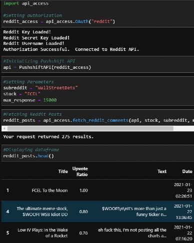
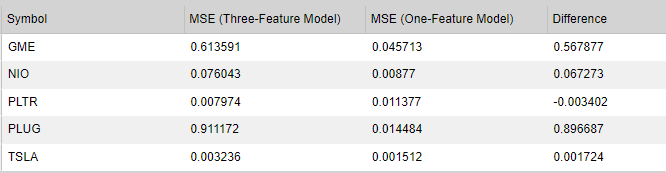

By: Camillo D'Orazio, Todd Shevlin, Daniel Singer, Gregory Terrinoni - January 2021

# Overview 

Armed with easy access to stock investing through Robinhood and the ability to coordinate and share ideas through social media platforms like Twitter and Reddit, young traders are finding themselves in the surprising position of wielding an outsized amount of influence on stock prices.  

This project analyzes a basket of momemtum stocks that are most talked about on social media platforms, and more specifically, wildly hyped by millenials.  Our basket includes: 

* GME - GameStop
* TSLA - Tesla
* PLTR - Plantair
* PLUG - PlugPower
* NIO - NIO Inc.

We utilized two different NLP models (NLTK and TextBlob) to calculate a daily sentiment score on posts across both StockTwits and the subreddit r/WallStreetBets over the past 5 months.  We then fed this data into an artifical recurrent neural network model (LSTM) to determine if the calculated sentiment scores had any predictive power for forecasting future prices in our basket of stocks.  

# Hypothesis

### Does social media chatter influence stock prices?

Going into this project we believed that social media sentiment (both positive and negative) would have an observable impact on the movement of stock prices.

# Model Summary

We utilized three models for this project:
    
1. NLTK - A well-known Natural Language Processing package used for sentiment analysis.
2. TextBlob - An alternative sentiment analysis tool, used in conjunction with the NLTK model.
3. The LSTM (Long Short Term Memory Recurrent Neural Network) model via Tensorflow/Keras, as it is one of the strongest predictive models we have used.

*If there were more time for the project, we would have liked to expand the number of features in our data set to include financial data (P/E, marketcap, divided, institutional holding %) as well as running some logistic regression models (ARIMA ect) to compare it versus the RNN model.*

# Data Cleanup & Model Training

*Describe the exploration and cleanup process.
Discuss any problems that arose with preparing the data or training the model that you didn't anticipate.
Discuss the overall training process and highlight anything of interest with the training process: Cloud resources used, training time required, issues with training.*
#### Obtaining And Structuring The Data

>API Connections 

Obtaining the data from various API's was challenging.  Some API's were not working correctly and others severely limited the available data.  After getting creative, we were able to access the front-end of the StockTwits API as well as utilizing a few wrappers (PRAW and PSAW) to connect to the Reddit API.

> Manipulating Data

Data manipulation was fairly straight forward.  Once the challenge of gathering the data from various APIs was accomplished it was just a matter of merging all the relevant pieces together.  The wrappers for the Reddit API helped immensely in terms of ease of access to the underlying data.

> Model Development

We tried to abstract away as much of the code as possible, writing multiple python files utilizing the classMethod syntax with all the underlying functions required to run our sentiment analysis and neural network models.  This made processing all of our data much easier and less time consuming without cluttering up our notebooks.

###### NLP 
We averaged the NLTK and TextBlob scores seperately, grouped by day to account for multiple posts per day, in order to generate our sentiment score.  Because our data included *actual* sentiment scores in the form of 'Likes', 'Upvote Ratios' and in the case of StocksTwits, a straight up declaration by the poster if they were bullish or bearish, we plotted some additional validation metrics of our generated scores versus these data points.

###### LSTM
We fed both one (lagged price) and three (price plus the two sentiment scores) features into our LSTM model for the purpose of comparing whether the addition of sentiment scores produced a more accurate prediction.  It was a matter of trial and error on the initial set up, playing with epochs, batch-size, and window size when trying to fit the model.  

# Model Evaluation

As mentioned above, we ran the same baseline model without the sentiment scores so we could compare the impact of adding the sentiment feature to the model performance.

There was a lot of variability in the model across the basket of stocks.  Some performed pretty well while others were abysmal:

# Analysis Results / Observations

*Discuss your findings. Was the model sufficient for the predictive task? If not, why not? What inferences or general conclusions can you draw from your model performance?*  

# Postmortem

*Discuss any difficulties that arose, and how you dealt with them.
Discuss any additional questions or problems that came up but you didn't have time to answer: What would you research next if you had two more weeks?*
There was definitely some user error at times.  Referencing the incorrect dataframe, overwriting one class with another class, or running/outputting to the incorrect file.
Overall, we probably spent too much time getting the data into the correct format for the models.  This should improve with experience and practice.
The API limitations caused us to switch over to CSVs for input, which worked fine for the build.  In a production environment we would switch out the CSV inputs to API calls.
With additional time and data availability, we would use more data to train the model to see if it improves, add additional features, and increase the comparisons to determine the strength of the effect of different features on the model.  

## Datasets to be used
- Institutional vs. Retail Investor (Non-Insitutional) data
- Reddit API
- Quandl API
- Alpaca API
- Twitter API
- News API
- Discord API
- Telegram API
- StockTwits API (Beautiful Soup as a backstop)

____________________________________________________________________________________________________________________
1 Emoji images - https://i1.wp.com/thedatascientist.com/wp-content/uploads/2018/10/sentiment-analysis.png

2 Duggan, W. (2021, January 8) *10 Momentum Stocks Millennials Love in 2021* U.S. News and World Report https://money.usnews.com/investing/stock-market-news/slideshows/momentum-stocks-millennials-are-buying?slide=7

3 Moeller, M. (2018, February 26) *Ethereum Competitors: Guide to the Alternative Smart Contract Platforms* Blockonomi.com https://blockonomi.com/ethereum-competitors/

4 Dughi, P. (2018, February 3) *A simple explanation of how blockchain works* Mission.org https://medium.com/the-mission/a-simple-explanation-on-how-blockchain-works-e52f75da6e9a#:~:text=Blockchain%20is%20the%20technology%20the%20underpins%20digital%20currency,a%20%E2%80%9Cdigital%20ledger%E2%80%9D%20stored%20in%20a%20distributed%20network.

5 Reiff, N. (2020, June 16) *Bitcoin vs. Ethereum: What's the Difference?* Investopedia https://www.investopedia.com/articles/investing/031416/bitcoin-vs-ethereum-driven-different-purposes.asp.

6 YouTube video ... Justin to document

7 Denominations of Ether source: https://nagritech.com/wp-content/uploads/2020/04/Screenshot-22.png

8 

## Perform machine learning, produce graphs, make interactive via a Dashboard
- Good example .... http://www.sentdex.com/financial-analysis/?i=GME&tf=all&style=overlay

Below is another format for including web images in this document.

15

